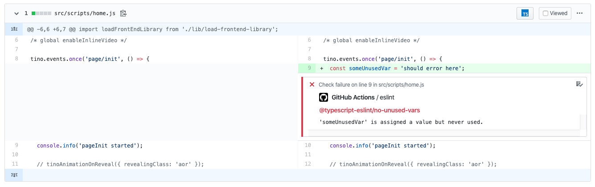

# Lint change Pull Request files with ESLint from GitHub Action

Using this GitHub Action, scan files changed in current Pull Request with inline code annotations:



## Usage

The workflow, usually declared in `.github/workflows/lint.yml`, looks like:

```yml
name: Lint

on: pull_request

jobs:
  eslint:
    runs-on: ubuntu-latest
    steps:
      - uses: actions/checkout@v1
        with:
          fetch-depth: 1
      - uses: actions/setup-node@v1
        with:
          node-version: 12
      - run: rm .yarnclean
      - run: yarn --frozen-lockfile --ignore-engines --ignore-optional --no-bin-links --non-interactive --silent --ignore-scripts --production=false
        env:
          PUPPETEER_SKIP_CHROMIUM_DOWNLOAD: true
          HUSKY_SKIP_INSTALL: true
      - uses: tinovyatkin/action-eslint@v1
        with:
          repo-token: ${{secrets.GITHUB_TOKEN}}
          check-name: eslint
```

## License

All scripts and documentation in this project are released under the LGPLv3 License.
